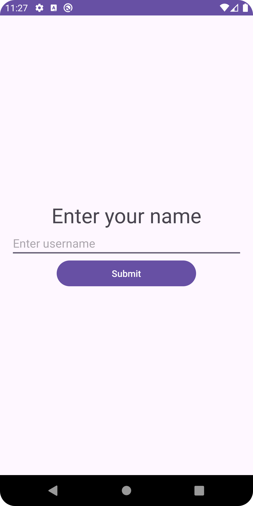
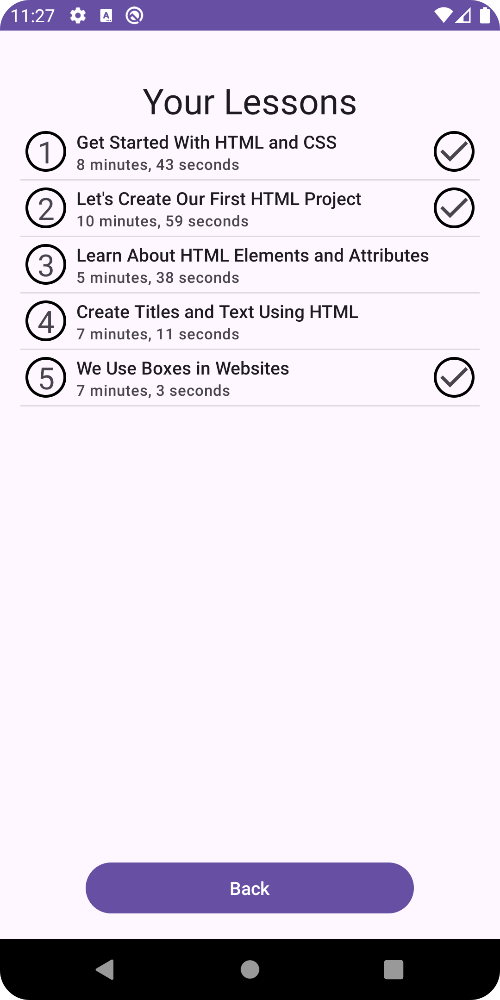

# Lesson Tracker

Our currently unnamed lesson tracker is a lightweight Android App that allows users to keep track of their progress in a pre-loaded HTML design course. While the applet only contains 5 lessons at the moment, more can be added with no hassle.

Welcome Screen | Lesson List View
:-------------:|:------------------:
 | 

## Technologies used

- Android SDK
- Google GSON

## Installation and Usage

Import the project into your Android Studio install and use the default build command. A proper `.apk` release is still in the works.

## Potential Improvements

- Provide a user interface for the editing of included lessons.
- Expand the lesson list system to allow for multiple lists.
- Use [Firebase](https://firebase.google.com) or something similar to allow for online progress storage.
- Proper landscape mode and dark theme support.
- Use resource strings instead of hard coded text for language support.
